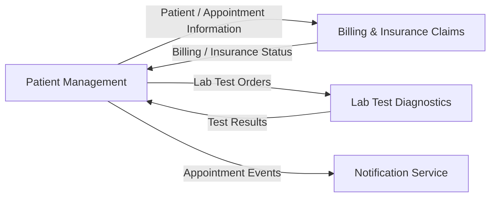

# Patient Care Context — Domain Context Map

## Bounded Contexts

### Patient Management
**Entities:** Patient, Appointment, Medical Record, Doctor

Manages patient information, appointments, medical records, and patient care activities.

### Billing & Insurance Claims
**Entities:** Invoice, Payment, Insurance Claim, Insurance Provider

Manages patient billing, payments, insurance verification, and insurance claims.

### Lab Test Diagnostics
**Entities:** Lab Test, Test Order, Sample, Test Result, Diagnosis

Manages laboratory test requests, samples, test results, and diagnostic information.
